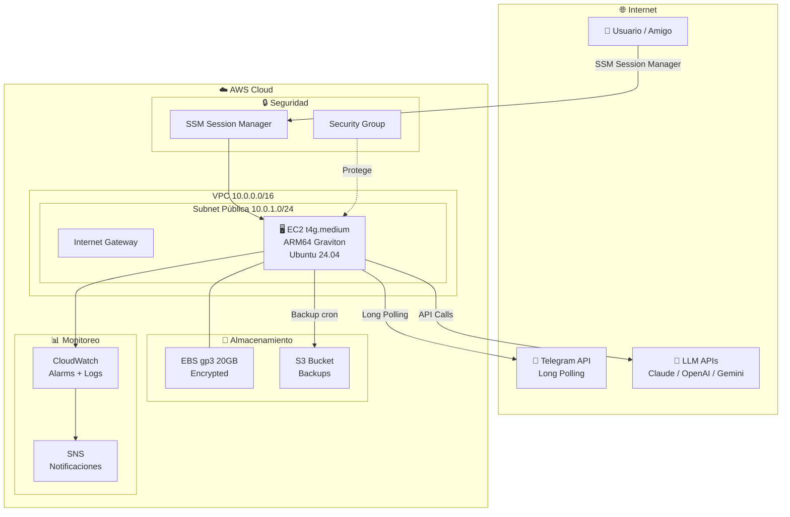
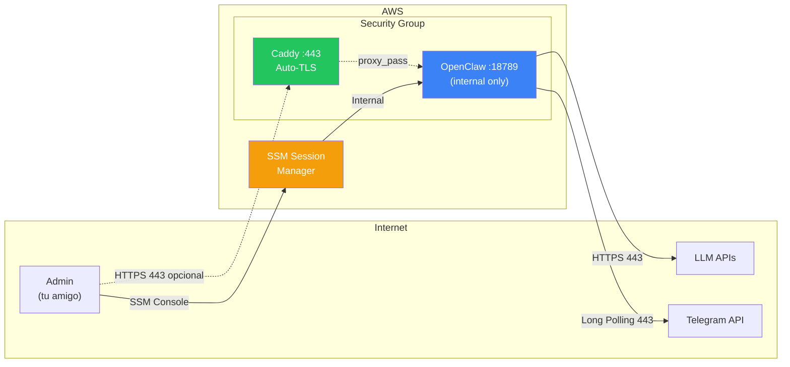

# Arquitectura AWS para OpenClaw — Agente AI Personal

Diseño de infraestructura AWS para desplegar OpenClaw como agente personal autónomo en una instancia EC2 con Docker, siguiendo los pilares del **AWS Well-Architected Framework** y mejores prácticas de la industria.

## Resumen Ejecutivo

OpenClaw es un agente AI autónomo open-source que se auto-hospeda. Usa **Node.js**, almacena datos en **Markdown + SQLite** (local-first), y se conecta a **Telegram** como canal de mensajería. **No requiere** Fargate, ElastiCache ni bases de datos externas.

La arquitectura propuesta es un **single-server deployment** en **us-east-1 (N. Virginia)** optimizado para costo, seguridad y mantenibilidad — ideal para un solo usuario.

---

## Decisiones Confirmadas

| Parámetro | Decisión |
|-----------|----------|
| **Región AWS** | `us-east-1` (N. Virginia) |
| **Canal de mensajería** | **Telegram** (long polling — no requiere dominio ni HTTPS para webhooks) |
| **Presupuesto** | Sin límite fijo (~$21 USD/mes estimado, aceptado) |
| **Experiencia del usuario** | Tiene experiencia Linux, pero se incluye guía paso a paso |
| **Gestión de credenciales** | Directamente en OpenClaw (`openclaw onboard`) |

> [!TIP]
> **Telegram con Long Polling**: Telegram soporta **long polling** nativo, lo que significa que OpenClaw abre una conexión saliente al API de Telegram — **no necesita dominio, IP pública expuesta, ni certificados HTTPS** para funcionar con Telegram. Esto simplifica enormemente la arquitectura y la seguridad.

> [!NOTE]
> **¿Y Caddy/HTTPS?** Se mantiene Caddy en el stack como opción para acceder al **Control UI** de OpenClaw de forma segura si tu amigo lo desea en el futuro (o si migra a webhooks). Pero para Telegram con long polling, **no es estrictamente necesario**.

> [!WARNING]
> **API Keys de LLM**: OpenClaw es model-agnostic. Tu amigo necesitará su propia API key (Claude, OpenAI, Gemini, etc.). Las configurará directamente en OpenClaw con `openclaw onboard`. Esto **no** se incluye en el costo AWS.

---

## Arquitectura de Alto Nivel



---

## Proposed Changes

### 1. Networking — VPC & Subnets

Infraestructura de red minimalista pero segura.

#### [NEW] cloudformation/01-network.yml

```yaml
# Recursos a crear:
VPC:                  10.0.0.0/16
├── Public Subnet:    10.0.1.0/24 (AZ-a)
├── Internet Gateway
├── Route Table:      0.0.0.0/0 → IGW
└── VPC Flow Logs → CloudWatch Log Group
```

**Decisiones de diseño:**
- **Una sola subnet pública**: OpenClaw necesita recibir webhooks directamente → no tiene sentido poner un ALB delante de una sola instancia (costo innecesario de ~$16/mes)
- **Sin NAT Gateway**: El EC2 está en subnet pública con IP pública. NAT Gateway cuesta ~$32/mes — injustificable para un solo servidor
- **VPC Flow Logs habilitados**: Visibilidad de red para auditoría y detección de anomalías

---

### 2. Compute — EC2 Instance

#### [NEW] cloudformation/02-compute.yml

**Instancia seleccionada: `t4g.medium`** (2 vCPU ARM64, 4 GB RAM)

| Criterio | Justificación |
|---|---|
| **Familia t4g** | Graviton ARM64 = 20-40% mejor precio/rendimiento vs Intel |
| **Tamaño medium** | 4 GB RAM cubre "Standard deployment" de OpenClaw (2-4 GB) con margen para Docker overhead |
| **Burstable** | OpenClaw es idle la mayoría del tiempo, burst cuando procesa → patrón ideal para T-series |
| **Costo** | ~$16-17/mes on-demand, reducible a ~$10/mes con Savings Plan 1yr |

**Configuración del EC2:**
- **AMI**: Ubuntu 24.04 LTS ARM64 (Canonical oficial)
- **EBS Root**: 20 GB gp3, encrypted con KMS default
- **User Data**: Bootstrap script que instala Docker, Docker Compose, y configura OpenClaw
- **IMDSv2**: Enforced (previene SSRF credential theft)
- **Elastic IP**: Asociada para IP estática (necesaria para DNS/webhooks)
- **Key Pair**: Ninguno — acceso exclusivamente por SSM Session Manager

---

### 3. Security — Defense in Depth

#### [NEW] cloudformation/03-security.yml

**Security Group — Reglas Inbound:**

| Puerto | Protocolo | Origen | Propósito |
|--------|-----------|--------|----------|
| 443 | TCP | `0.0.0.0/0` | HTTPS — Control UI de OpenClaw (opcional, via Caddy) |
| 80 | TCP | `0.0.0.0/0` | HTTP → redirect a HTTPS (Caddy) |

> [!TIP]
> Con Telegram en **long polling**, técnicamente no se necesitan puertos inbound. Se mantienen 80/443 solo si tu amigo quiere acceder al Control UI web de OpenClaw. Si no, se pueden cerrar completamente y acceder solo por SSM.

> [!NOTE]
> **Sin puerto 22 (SSH)**: El acceso es exclusivamente por **SSM Session Manager**. Esto elimina un vector de ataque completo — no hay key pairs que gestionar, no hay brute-force posible.

**Security Group — Reglas Outbound:**

| Puerto | Protocolo | Destino | Propósito |
|--------|-----------|---------|----------|
| 443 | TCP | `0.0.0.0/0` | APIs LLM + Telegram API + dependencias npm |
| 53 | UDP/TCP | `0.0.0.0/0` | DNS |

**IAM Role (Least Privilege):**
```json
{
  "Effect": "Allow",
  "Action": [
    "ssm:StartSession",           // SSM acceso
    "s3:PutObject",               // Backup a S3
    "s3:GetObject",               // Restore desde S3
    "cloudwatch:PutMetricData",   // Custom metrics
    "logs:PutLogEvents"           // CloudWatch Logs
  ]
}
```

**Gestión de Credenciales:**
> [!NOTE]
> Tu amigo configurará sus API keys y tokens directamente en OpenClaw usando `openclaw onboard` o editando `~/.openclaw/openclaw.json`. Estos archivos se almacenan en el volumen Docker persistente y se incluyen en los backups automáticos a S3.

---

### 4. Reverse Proxy — Caddy (Auto-TLS)

#### Configuración dentro del Docker Compose

**¿Por qué Caddy sobre Nginx?**
- **Auto-TLS gratuito**: Obtiene y renueva certificados Let's Encrypt automáticamente
- **Zero-config HTTPS**: No hay que configurar certbot, cron jobs ni renovaciones
- **Footprint mínimo**: ~30 MB de RAM

```
Caddyfile:
  yourdomain.com {
    reverse_proxy openclaw-gateway:18789
    header {
      Strict-Transport-Security "max-age=31536000"
      X-Content-Type-Options "nosniff"
      X-Frame-Options "DENY"
    }
  }
```

---

### 5. Docker Compose — Stack Completo

#### [NEW] docker/docker-compose.yml

```yaml
services:
  caddy:
    image: caddy:2-alpine
    ports:
      - "80:80"
      - "443:443"
    volumes:
      - ./Caddyfile:/etc/caddy/Caddyfile
      - caddy_data:/data
      - caddy_config:/config
    restart: unless-stopped
    depends_on:
      openclaw:
        condition: service_healthy

  openclaw:
    image: openclaw/openclaw:latest
    volumes:
      - openclaw_workspace:/root/.openclaw/workspace
      - openclaw_config:/root/.openclaw
    healthcheck:
      test: ["CMD", "curl", "-f", "http://localhost:18789/healthz"]
      interval: 30s
      timeout: 10s
      retries: 3
      start_period: 40s
    restart: unless-stopped
    deploy:
      resources:
        limits:
          memory: 3G
          cpus: '1.5'
        reservations:
          memory: 512M
          cpus: '0.25'

volumes:
  openclaw_workspace:
  openclaw_config:
  caddy_data:
  caddy_config:
```

---

### 6. Backup & Disaster Recovery

#### [NEW] scripts/backup.sh

**Estrategia 3-2-1 adaptada:**

| Capa | Mecanismo | RPO | Retención |
|------|-----------|-----|-----------|
| **EBS Snapshots** | AWS Backup automático diario | 24h | 7 días |
| **S3 Sync** | Cron cada 6h → `aws s3 sync` del workspace | 6h | 30 días |
| **S3 Lifecycle** | Transición a Glacier Deep Archive | — | 90 días → delete |

```bash
#!/bin/bash
# Backup script — ejecutado por cron cada 6h
TIMESTAMP=$(date +%Y%m%d-%H%M%S)
BUCKET="s3://openclaw-ronaldo-backups"

# Compress workspace
tar -czf /tmp/openclaw-backup-${TIMESTAMP}.tar.gz \
  /var/lib/docker/volumes/openclaw_workspace/_data/

# Upload to S3
aws s3 cp /tmp/openclaw-backup-${TIMESTAMP}.tar.gz \
  ${BUCKET}/workspace/${TIMESTAMP}.tar.gz \
  --storage-class STANDARD_IA

# Cleanup local
rm /tmp/openclaw-backup-${TIMESTAMP}.tar.gz

# Prune old backups (keep 30 days)
aws s3 ls ${BUCKET}/workspace/ | \
  awk '{print $4}' | \
  head -n -120 | \
  xargs -I {} aws s3 rm ${BUCKET}/workspace/{}
```

---

### 7. Monitoring & Alerting

#### [NEW] cloudformation/04-monitoring.yml

**CloudWatch Alarms:**

| Alarma | Métrica | Umbral | Acción |
|--------|---------|--------|--------|
| CPU Alta | CPUUtilization | > 80% por 5min | SNS → Email |
| Memoria | mem_used_percent (CW Agent) | > 85% | SNS → Email |
| Disco | disk_used_percent | > 80% | SNS → Email |
| StatusCheck | StatusCheckFailed | ≥ 1 | EC2 Auto-Recovery |
| Health Check | Custom OpenClaw /healthz | Fail 3x | SNS → Email |

**EC2 Auto-Recovery:**
- Si falla el status check del sistema → la instancia se recupera automáticamente en nuevo hardware
- El EBS y la IP elástica se mantienen — zero data loss

**SNS Topic:**
- Email de notificación al amigo para alertas críticas

---

### 8. User Data Bootstrap Script

#### [NEW] scripts/user-data.sh

```bash
#!/bin/bash
set -euo pipefail

# 1. System updates
apt-get update && apt-get upgrade -y

# 2. Install Docker
curl -fsSL https://get.docker.com | sh
usermod -aG docker ubuntu

# 3. Install Docker Compose v2
apt-get install -y docker-compose-plugin

# 4. Install AWS CloudWatch Agent
wget https://s3.amazonaws.com/amazoncloudwatch-agent/ubuntu/arm64/latest/amazon-cloudwatch-agent.deb
dpkg -i amazon-cloudwatch-agent.deb

# 5. Install SSM Agent (pre-installed on Ubuntu AMIs)
systemctl enable amazon-ssm-agent
systemctl start amazon-ssm-agent

# 6. Create OpenClaw directory structure
mkdir -p /opt/openclaw
cd /opt/openclaw

# 7. Setup docker-compose.yml and Caddyfile
# (se copian desde S3 o se generan inline)
# Las credenciales de LLM las configurará tu amigo
# directamente en OpenClaw con: openclaw onboard

# 8. Start services
docker compose up -d

# 9. Setup backup cron
echo "0 */6 * * * /opt/openclaw/scripts/backup.sh" | crontab -

# 10. Unattended upgrades
apt-get install -y unattended-upgrades
dpkg-reconfigure -f noninteractive unattended-upgrades
```

---

## Diagrama de Seguridad — Flujo de Red



---

## Estimación de Costos Mensuales

| Recurso | Especificación | Costo/mes (USD) |
|---------|---------------|-----------------|
| EC2 t4g.medium | On-Demand 24/7 | ~$16.50 |
| EBS gp3 20GB | Encrypted | ~$1.60 |
| Elastic IP | Asociada a EC2 | $0.00 (gratis si asociada) |
| S3 (backups) | ~5 GB Standard-IA | ~$0.06 |
| CloudWatch | Logs + 5 alarms | ~$2.50 |

| Data Transfer | ~5 GB out | ~$0.45 |
| **TOTAL On-Demand** | | **~$21.11** |
| **TOTAL con Savings Plan 1yr** | | **~$14-16** |

> [!TIP]
> Con un **Compute Savings Plan de 1 año (No Upfront)**, el EC2 baja a ~$10.50/mes, reduciendo el total a ~$15-17/mes.

---

## Estructura de Archivos del Proyecto

```
OpenClawRonaldo/
├── cloudformation/
│   ├── 01-network.yml          # VPC, Subnet, IGW, Flow Logs
│   ├── 02-compute.yml          # EC2, EBS, EIP, IAM Role
│   ├── 03-security.yml         # Security Groups
│   └── 04-monitoring.yml       # CloudWatch, SNS, Auto-Recovery
├── docker/
│   ├── docker-compose.yml      # OpenClaw + Caddy stack
│   └── Caddyfile               # Reverse proxy config
├── scripts/
│   ├── user-data.sh            # Bootstrap del EC2
│   ├── backup.sh               # Backup a S3
│   ├── restore.sh              # Restore desde S3
│   └── deploy.sh               # Script de despliegue
├── docs/
│   ├── SETUP_GUIDE.md          # Guía paso a paso para tu amigo
│   ├── TROUBLESHOOTING.md      # Solución de problemas comunes
│   └── ARCHITECTURE.md         # Este documento exportado
└── README.md                   # Overview del proyecto
```

---

## Verification Plan

### Automated Tests
```bash
# Validar templates CloudFormation
aws cloudformation validate-template --template-body file://cloudformation/01-network.yml
aws cloudformation validate-template --template-body file://cloudformation/02-compute.yml
aws cloudformation validate-template --template-body file://cloudformation/03-security.yml
aws cloudformation validate-template --template-body file://cloudformation/04-monitoring.yml

# Lint con cfn-lint
cfn-lint cloudformation/*.yml
```

### Manual Verification
1. Desplegar stack de CloudFormation en orden (01 → 04)
2. Verificar que EC2 arranca y pasa health checks
3. Verificar acceso SSM Session Manager
4. Verificar que Docker Compose levanta los servicios
5. Verificar que `/healthz` responde 200 (via SSM port forward o Caddy)
6. Ejecutar backup manual y verificar en S3
7. Tu amigo se conecta por SSM y configura OpenClaw (`openclaw onboard`)
8. Verificar conexión con Telegram Bot (long polling activo)
9. Enviar mensaje de prueba al bot en Telegram y verificar respuesta

---

## Pilares Well-Architected Aplicados

| Pilar | Implementación |
|-------|---------------|
| **Operational Excellence** | IaC (CloudFormation), User Data idempotente, monitoring automático, backups cronificados |
| **Security** | Zero SSH, IMDSv2, Security Groups mínimos, EBS encrypted, unattended-upgrades, credenciales en config local del agente |
| **Reliability** | EC2 Auto-Recovery, backups 3-2-1, health checks con auto-restart (Docker), EBS snapshots |
| **Performance** | Graviton ARM64 para mejor precio/rendimiento, gp3 optimizado, resource limits en Docker |
| **Cost Optimization** | t4g.medium justo para workload, S3-IA para backups, sin ALB/NAT innecesarios, Savings Plan ready |
| **Sustainability** | Graviton consume menos energía por compute unit que Intel/AMD |
